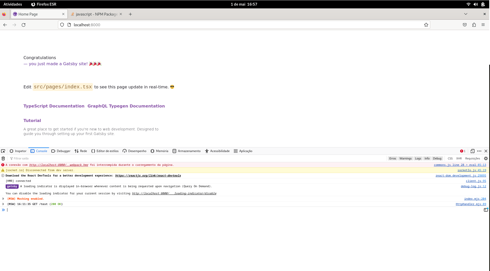

<p align="center">
  <a href="https://www.gatsbyjs.com/?utm_source=starter&utm_medium=readme&utm_campaign=minimal-starter-ts">
     </a> + <a href="https://mswjs.io/"></a>
</p>
<h1 align="center">
  Prova de conceito sobre o Mock Service Worker no Gatsby
</h1>



## 🚀 Passos iniciais

1.  **Crie uma aplicação Gatsby**

    Use o Gatsby CLI para criar um novo site, specificando o inciador minimo TypeScript.

    Com o yarn:

    ```shell
    # cria um novo site, specificando o inciador minimo TypeScript.
    yarn init gatsby -- -ts
    ```

    Com o NPM:

    ```shell
    # cria um novo site, specificando o inciador minimo TypeScript.
    npm init gatsby -- -ts
    ```

2.  **Instale o Mock Service Worker**

    Com o yarn:

    ```shell
    yarn add --develop msw
    ```

    Com o NPM:

    ```shell
    npm install --develop msw

3.  **Inizialize o Mock Service Worker**

    Com o yarn:

     ```shell 
     yarn msw init ./public/
     ```
    
    Com o NPX

    ```shell 
     npx msw init ./public/
    ```

4.  **Mãos a obra**

    **Crie na pasta src/mocks/handlers o arquivo handlers.ts com o seguinte conteúdo:**

        import { http, HttpResponse } from "msw";

        export const handlers = [
            http.get('/test',()=>{
                return HttpResponse.json({id: "teste"});
            })
        ]
        
    **Edite o arquivo gatsby-browser.js e inclua as seguintes linhas:**
    
        import { setupWorker } from 'msw/browser'
        import { handlers } from './src/mocks/handlers';


        if (process.env.NODE_ENV === 'development') {
            async function startMSW() {
                return setupWorker(...handlers)
            };
            startMSW().then((worker) => {
                worker.start();
            });
        }
        

5.  **Aprenda mais**

    - [Documentação do Gatsby](https://www.gatsbyjs.com/docs/?utm_source=starter&utm_medium=readme&utm_campaign=minimal-starter-ts)
    - [Documentation do MSW](https://mswjs.io/docs)
    - [Tutoriais](https://www.youtube.com/watch?v=pP8FQnv6o7A)
    
